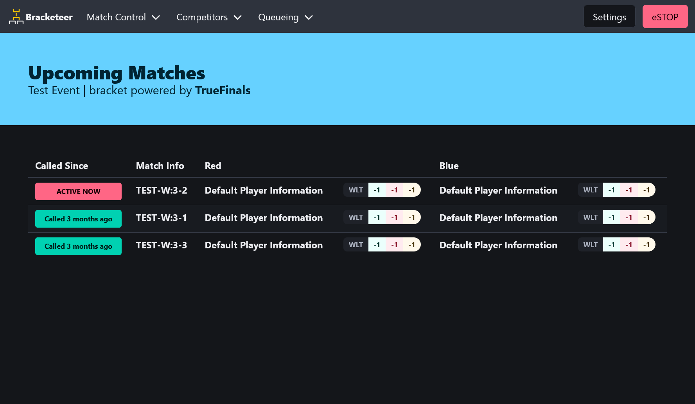
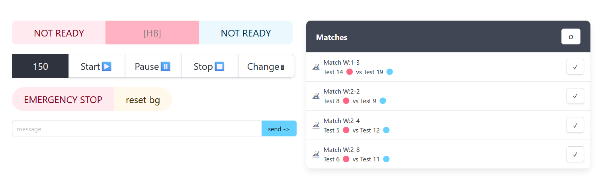

# Bracketeer - for fun and glory.

A work-in-progress tool to run the timers for matches for combat robotics, as well as some stream overlay stuff.

This was initially built for the [Garden State Combat Robotics League](https://www.gscrl.org) but much of it is portable to other organizing bodies.

## Core Features

View all of your event brackets in one place, coordinate multi-arena events, and show the timer on stream for your event production needs.

## Installation

This tool requires use of python (3.9+), `uv`

This system is written in python and managed with poetry.

To install you'll need python 3.9 or greater, then to install `uv`, then uv run main.py

## Building

To build the package, run `uv install --extra dev` and then ` uv pip install -e .` (for the package, otherwise just run `uv run ./bracketeer/__main.py`)

## Networking Setup

When running the host computer, setting a static IP address is not optional.  If not done so, you may have timer clients disconnect and unable to find the origin.

GSCRL uses `192.168.8.250` due to the DHCP range by default of our [travel router](https://www.amazon.com/GL-iNet-GL-SFT1200-Secure-Travel-Router/dp/B09N72FMH5).  Anything will work, but be consistent and set the netmask properly (/24 | 255.255.255.0 by default)

GSCRL *also* sets a DNS override in the DNS server on the travel router to make `192.168.8.250` point to `arena.gscrl.org`.  This was a legacy holdover from when using slow-rotating but externally validated Let's Encrypt setups even offline, but was retained for convenience.

## Additional Tools

The `_notebooks` directory contains any tools built to make running a league easier (such as the GSCRL District Point model for advancement to the season championship).

To run said notebooks, install jupyter and then run `jupyter notebook`.